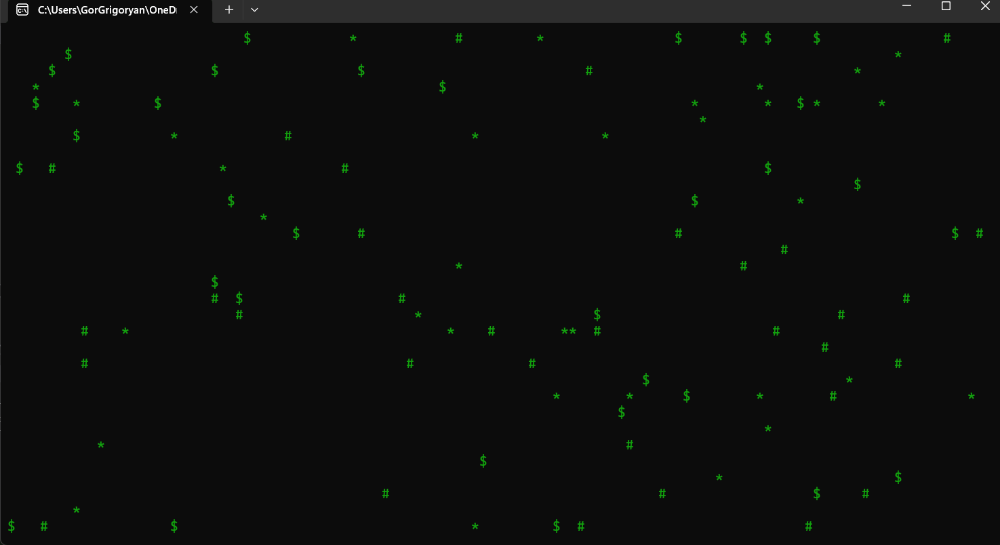
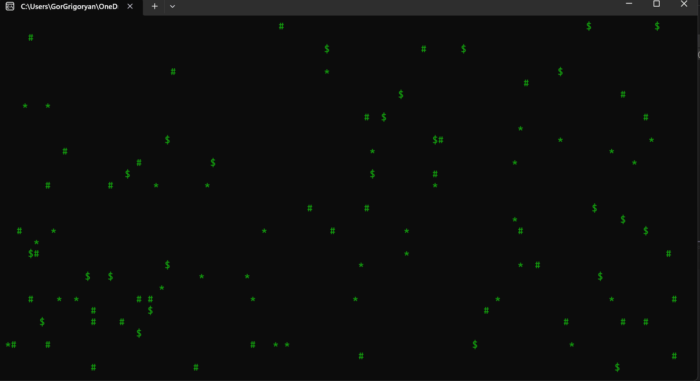
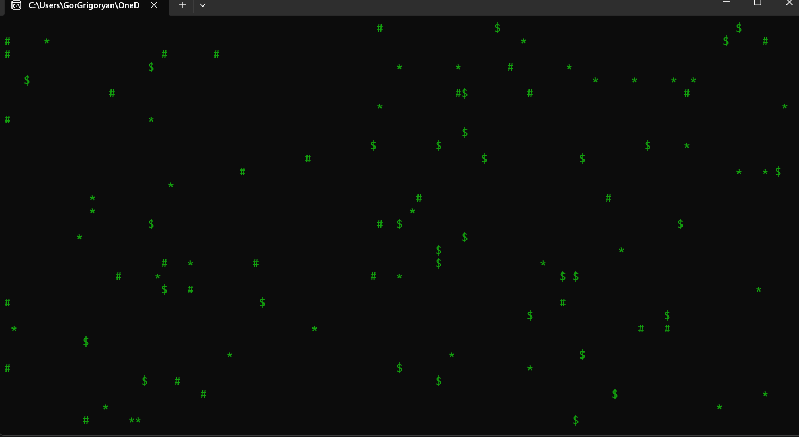
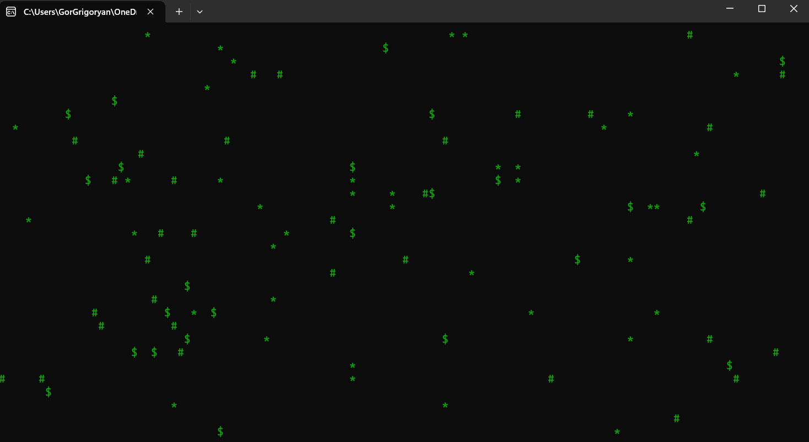

# Starfield-Animation-Dotnet
Basic starfield animation in terminal using C# .NET

This C# console application creates a starfield animation. Stars appear to move towards the viewer, creating a captivating visual effect.

There are 4 available movement options:

1. FromUpToDown
	
2. FromDownToUp
	
3. FromLeftToRight
	
4. FromRightToLeft
	

All configurations (like color, chars count, speed) can be changed from source code.